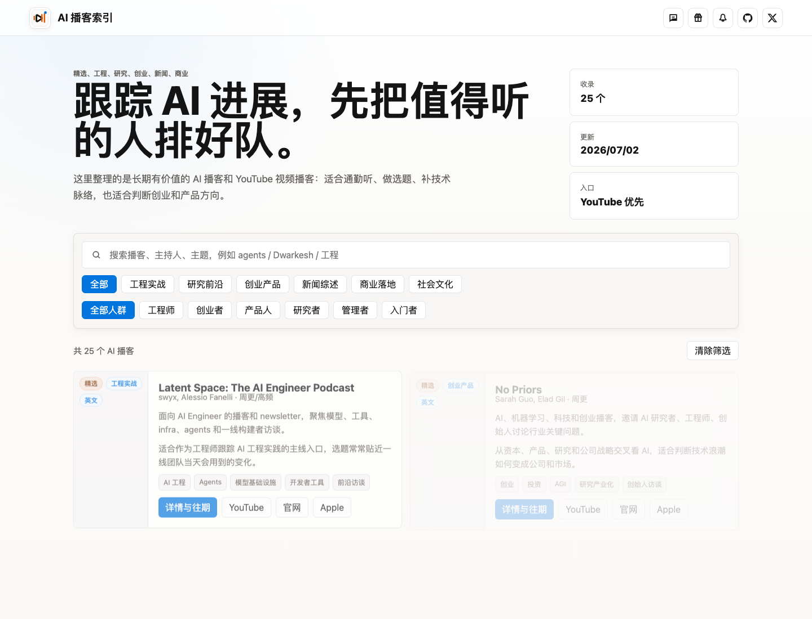

# AI 播客索引

**中文** | [English](#english)

[](https://youtube.qiaomu.ai/)
[](LICENSE)
[](#快速开始)



> 面向 AI 学习者、工程师、创业者和产品人整理的 AI 播客索引：把值得长期跟踪的节目、中文标题简介、Transcript 状态和总结入口放到一个静态网站里。
>
> A curated static index of AI podcasts, translated episode metadata, transcript status, and summary links.

**在线访问:** [youtube.qiaomu.ai](https://youtube.qiaomu.ai/)

**当前实测:** `npm run check` 通过，覆盖 25 个播客、125 期节目、99 份 Transcript、125 份总结/概要，其中 99 份为 Transcript-backed 深度总结。

## 这是什么

这是 `youtube.qiaomu.ai` 的源代码和数据仓库。它把 AI 相关播客整理成一个可搜索、可筛选、可持续更新的静态站点，重点解决三个问题：

| 问题 | 站点提供什么 |
|---|---|
| AI 播客太分散 | 按研究、工程、创业、新闻、商业、文化等主题聚合 |
| 英文标题和简介扫读成本高 | 每期节目补中文标题和中文简介 |
| 是否值得深入听很难判断 | 展示 Transcript、深度总结或兜底概要状态 |

## 功能

| 能力 | 用户得到什么 |
|---|---|
| 播客目录 | 25 个 AI 播客/访谈源，含官网、Apple Podcasts、YouTube 入口 |
| 节目快照 | 每个播客保留最近节目列表、发布时间、音频入口 |
| 中文化元数据 | 每期节目都有中文标题和中文简介，保留英文原文 |
| Markdown 渲染 | 总结页支持 GitHub Flavored Markdown，包括表格、列表、代码块、链接 |
| 资源状态 | 区分 `Transcript`、`总结笔记`、`简介概要`、`页面概要` |
| 静态部署 | 构建后可直接部署到任意 Nginx/CDN 静态目录 |

## 快速开始

```bash
npm install
npm run check
npm run build
npm run serve
```

打开 `http://127.0.0.1:4173/` 预览。

## 常用命令

```bash
# 校验数据结构、分类、链接、资源统计
npm run check

# 重新生成播客详情页和 Markdown 资源页
npm run build

# 本地静态预览
npm run serve

# Playwright smoke test，默认检查本地 4173
npm run smoke:ui
```

## 数据更新

核心数据在：

```text
data/podcasts.json          # 播客清单
data/episodes/*.json        # 最近节目快照
content/transcripts/**/*.md # Transcript Markdown
content/summaries/**/*.md   # 总结/概要 Markdown
```

常规更新流程：

```bash
npm run fetch:episodes
npm run enrich:youtube
npm run translate:episodes
npm run import:youtube-captions
npm run summarize:descriptions
npm run summarize:transcripts
npm run build
npm run check
```

仓库也包含一组可选的自动化脚本，用于接入个人配置的第三方笔记/转写服务。这部分需要本机环境变量和个人账号权限，开源仓库不会包含运行态状态文件、日志、配额记录或任何凭证。

## 部署

站点是纯静态输出。Qiaomu 生产环境部署到：

```text
https://youtube.qiaomu.ai/
```

项目内的 `npm run deploy:static` 是向阳乔木个人 VPS 的部署脚本，依赖本机 SSH 配置。其他用户可以把 `index.html`、`app.js`、`styles.css`、`favicon.svg`、`public/`、`data/`、`content/` 和构建后的 `podcasts/` 上传到自己的静态站点。

## 隐私与边界

- 本仓库不包含 API Key、token、账号 cookie 或个人运行日志。
- `.gitignore` 会排除 `data/getnote-*.json`、`data/youtube-caption-state.json` 和 `logs/`。
- Transcript 和总结来自公开网页、RSS、字幕或用户自行配置的转写流程；请尊重原播客版权和平台条款。
- 站点只做学习索引，不代表原播客、嘉宾或平台立场。

## 项目结构

```text
.
├── data/                 # 播客和节目数据
├── content/              # Transcript 与总结 Markdown
├── public/qiaomu/        # 打赏和关注二维码等公开静态资源
├── scripts/              # 抓取、翻译、总结、构建、部署脚本
├── app.js                # 首页搜索与筛选
├── styles.css            # Notion 风格界面样式
├── favicon.svg           # 站点品牌图标
└── index.html            # 首页
```

## 实测验证

最近一次本机验证：

```text
npm run check
Validated 25 podcasts, 6 categories, 6 audiences, 125 episodes, 99 transcripts, 125 summaries (99 transcript-backed, 26 fallback).
```

## 关于向阳乔木

- 网站：[qiaomu.ai](https://qiaomu.ai/)
- 博客：[blog.qiaomu.ai](https://blog.qiaomu.ai/)
- 推荐：[tuijian.qiaomu.ai](https://tuijian.qiaomu.ai/)
- X：[@vista8](https://x.com/vista8)
- GitHub：[@joeseesun](https://github.com/joeseesun)
- 公众号：向阳乔木推荐看

## License

代码以 [MIT License](LICENSE) 开源。播客封面、音频、节目原文、Transcript 和引用内容归各自权利方所有。

---

<a name="english"></a>

# AI Podcast Index

[中文](#ai-播客索引) | **English**

AI Podcast Index is the source repository for [youtube.qiaomu.ai](https://youtube.qiaomu.ai/), a curated static site for following high-signal AI podcasts and video interviews.

It helps readers quickly scan:

- AI podcasts worth tracking over time.
- Chinese translations for episode titles and descriptions.
- Transcript availability.
- Transcript-backed summaries and fallback summaries.
- Original source links, official sites, Apple Podcasts links, YouTube links, and audio entries.

## Quick Start

```bash
npm install
npm run check
npm run build
npm run serve
```

Then open `http://127.0.0.1:4173/`.

## Verification

The latest local verification passed:

```text
Validated 25 podcasts, 6 categories, 6 audiences, 125 episodes, 99 transcripts, 125 summaries (99 transcript-backed, 26 fallback).
```

## Data And Automation

The public data lives in `data/podcasts.json`, `data/episodes/*.json`, `content/transcripts/**/*.md`, and `content/summaries/**/*.md`.

Some scripts can connect to a user-configured third-party note/transcription service. Those scripts require local environment variables and account access. Runtime state, quotas, logs, and credentials are intentionally excluded from the repository.

## Limits

This project is a learning index. Podcast artwork, audio, original show notes, transcripts, and quoted content belong to their respective owners. Please respect each source's copyright and platform terms.

## License

Code is released under the [MIT License](LICENSE). Content rights remain with their original owners.
